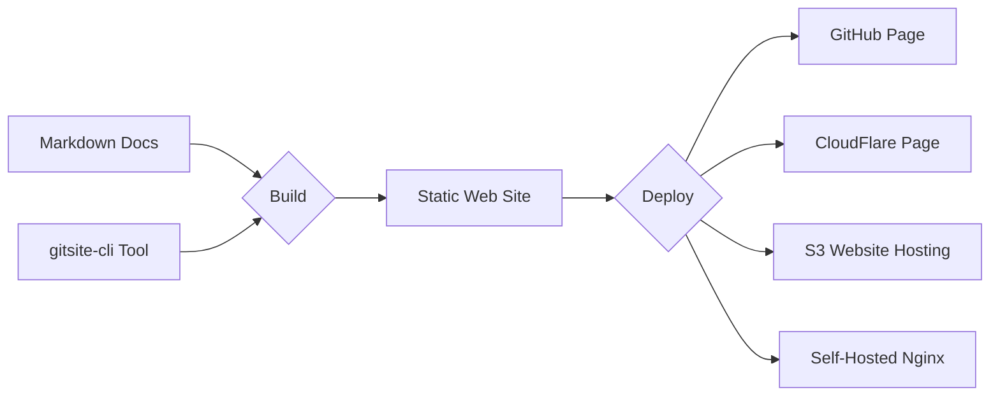

# GitSite Command Line Application

 

GitSite build your well-organized Markdown documents and other resources to static web site that can be deployed simply to GitHub page, etc.

Read the [user guide](https://gitsite.org).
