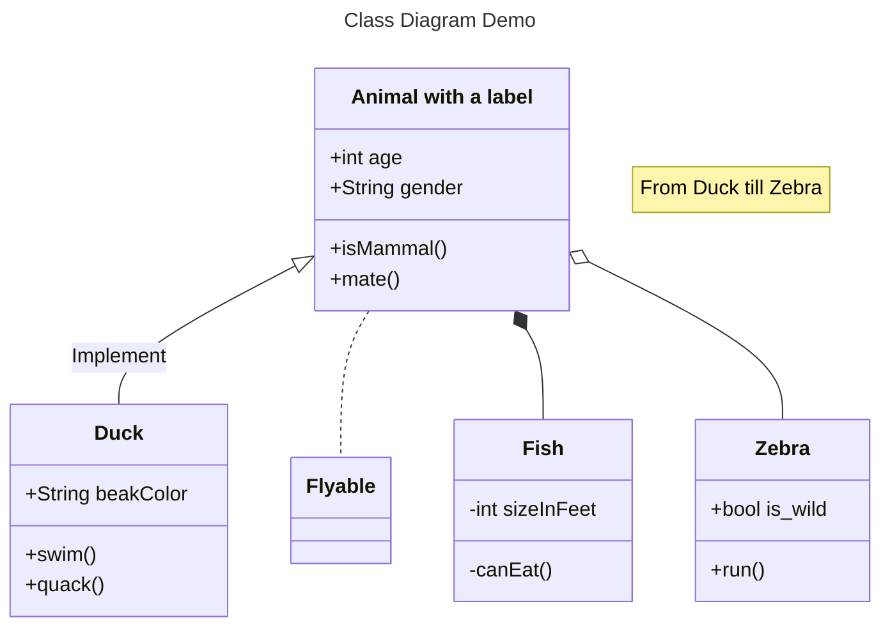

```mermaid
---
title: Class Diagram Demo
---
classDiagram
    class Animal["Animal with a label"]
    note "From Duck till Zebra"
    Animal <|-- Duck : Implement
    Animal .. Flyable
    Animal *-- Fish
    Animal o-- Zebra
    Animal : +int age
    Animal : +String gender
    Animal: +isMammal()
    Animal: +mate()
    class Duck{
      +String beakColor
      +swim()
      +quack()
    }
    class Fish{
      -int sizeInFeet
      -canEat()
    }
    class Zebra{
      +bool is_wild
      +run()
    }
```