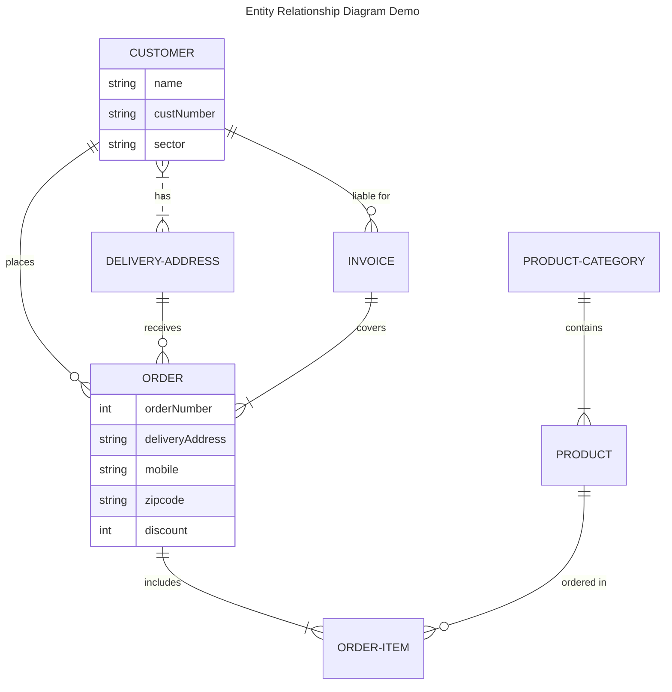

```mermaid
---
title: Entity Relationship Diagram Demo
---
erDiagram
    CUSTOMER {
        string name
        string custNumber
        string sector
    }
    ORDER {
        int orderNumber
        string deliveryAddress
        string mobile
        string zipcode
        int discount
    }
    CUSTOMER }|..|{ DELIVERY-ADDRESS : has
    CUSTOMER ||--o{ ORDER : places
    CUSTOMER ||--o{ INVOICE : "liable for"
    DELIVERY-ADDRESS ||--o{ ORDER : receives
    INVOICE ||--|{ ORDER : covers
    ORDER ||--|{ ORDER-ITEM : includes
    PRODUCT-CATEGORY ||--|{ PRODUCT : contains
    PRODUCT ||--o{ ORDER-ITEM : "ordered in"
```
