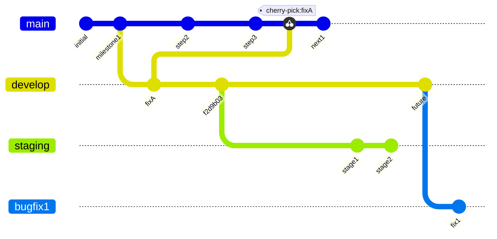

```mermaid
gitGraph
    commit id: "initial"
    commit id: "milestone1"
    branch develop
    commit id:"fixA"
    checkout main
    commit id:"step2"
    checkout develop
    commit id:"f2d9b03"
    checkout main
    commit id:"step3"
    cherry-pick id:"fixA"
    commit id:"next1"
    checkout develop
    branch staging
    commit id:"stage1"
    commit id:"stage2"
    checkout develop
    commit id:"future"
    branch bugfix1
    commit id:"fix1"
```
