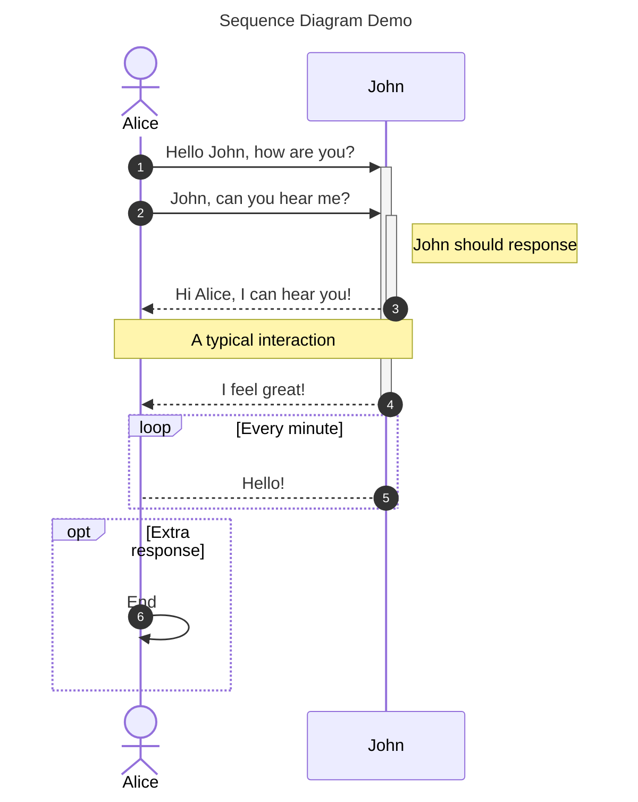

```mermaid
---
title: Sequence Diagram Demo
---
sequenceDiagram
    actor Alice
    autonumber
    Alice->>+John: Hello John, how are you?
    Alice->>+John: John, can you hear me?
    Note right of John: John should response
    John-->>-Alice: Hi Alice, I can hear you!
    Note over Alice,John: A typical interaction
    John-->>-Alice: I feel great!
    loop Every minute
        John-->Alice: Hello!
    end
    opt Extra response
        Alice->>Alice: End
    end
```